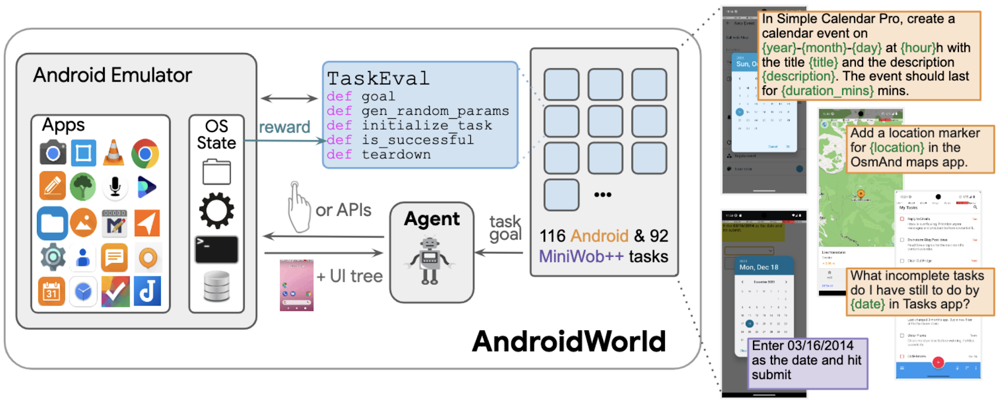
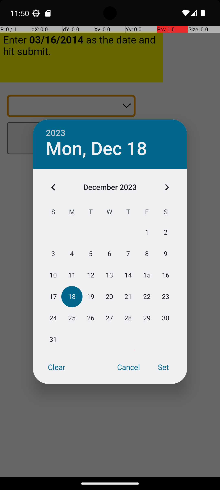

# AndroidWorld

<!-- mdlint off(WHITESPACE_LINE_LENGTH) -->

[](https://github.com/google-research/android_world/actions/workflows/pytest.yml)

<p align="center">
<a href="https://google-research.github.io/android_world/">Website</a> •
<a href="https://arxiv.org/pdf/2405.14573">Paper</a> •
<a href="https://google-research.github.io/android_world/task_list.html">Tasks</a> •
<a href="https://docs.google.com/spreadsheets/d/1cchzP9dlTZ3WXQTfYNhh3avxoLipqHN75v1Tb86uhHo/edit?gid=0#gid=0">Leaderboard</a>
</p>



**AndroidWorld** is an environment for building and benchmarking autonomous
computer control agents.

It runs on a live Android emulator and contains a highly reproducible benchmark
of 116 hand-crafted tasks across 20 apps, which are dynamically instantiated
with randomly-generated parameters to create millions of unique task variations.

In addition to the built-in tasks, AndroidWorld also supports the popular web benchmark, MiniWoB++ from [Liu et al.](http://arxiv.org/abs/1802.08802).

Key features of AndroidWorld include:

* 📝 **116 diverse tasks** across 20 real-world apps
* 🎲 **Dynamic task instantiation** for millions of unique variations
* 🏆 **Durable reward signals** for reliable evaluation
* 🐳 **Experimental Docker Support** for simplified setup and consistent environments (as of 06/02/2025)
* 🌐 **Open environment** with access to millions of Android apps and websites
* 💾 **Lightweight footprint** (2 GB memory, 8 GB disk)
* 🔧 **Extensible design** to easily add new tasks and benchmarks
* 🖥️ **Integration with MiniWoB++** web-based tasks

See demo videos on our [website](https://google-research.github.io/android_world/).
o

## Installation

1. Set up the Android Emulator
   1. Download Android Studio [here](https://developer.android.com/studio?gad_source=1&gclid=Cj0KCQjw3ZayBhDRARIsAPWzx8oLcadBD0vAq8xmUutaunLGSzhgEtLz4xVZ_SpV4G0xJazS7LxQkDsaAuveEALw_wcB&gclsrc=aw.ds)
   2. Create an Android Virtual Device (AVD) by following these instructions. For hardware select **Pixel 6**, for System Image select **Tiramisu, API Level 33**, and choose AVD name as **AndroidWorldAvd**. [Watch the setup video.](https://github.com/google-research/android_world/assets/162379927/efc33980-8b36-44be-bb2b-a92d4c334a50)

1. Launch the Android Emulator from the command line

    Launch the emulator from the command line, not using the Android Studio UI,
    with the `-grpc 8554` flag which is needed communication with accessibility
    forwarding app.

    ```bash
    # Typically it's located in ~/Android/Sdk/emulator/emulator or
    # ~/Library/Android/sdk/emulator/emulator
    EMULATOR_NAME=AndroidWorldAvd # From previous step
    ~/Library/Android/sdk/emulator/emulator -avd $EMULATOR_NAME -no-snapshot -grpc 8554
    ```

1. [Optional] It's recommended to use `conda`, which you can download [here](https://docs.anaconda.com/free/miniconda/miniconda-install/).

    ```
    conda create -n android_world python=3.11.8
    conda activate android_world
    ```

1. Install AndroidWorld. *Note: Python 3.11 or above is required.*

    ```python
    git clone https://github.com/google-research/android_world.git
    cd ./android_world
    pip install -r requirements.txt
    python setup.py install
    ```

1. Add model provider APIs as environment variables.

    ```bash
    # Add to .bashrc.
    export OPENAI_API_KEY=your-key
    export GCP_API_KEY=your-key
    ```

1. Install `ffmpeg`, if not already installed.

    ```bash
    # Linux (Ubuntu/Debian)
    # sudo apt update && sudo apt install ffmpeg

    # macOS
    brew install ffmpeg
    ```

## Quickstart

Run the `minimal_task_runner.py` script to see the basic mechanics of
AndroidWorld components. It initializes the environment, sets up a task, and
runs the default agent, M3A, on it.
```bash
python minimal_task_runner.py --task=ContactsAddContact
```

If you don't specify a task, a random task will be selected. *NOTE: If you want
to try open-source apps, i.e. not included with Android OS, please run
`--perform_emulator_setup` in the script below.*

**Note on Model Cost:** The `minimal_task_runner.py` script uses a legacy model `gpt-4-turbo-2024-04-09` by default. This model can be expensive. For serious usage, you can switch to a more cost-effective model, by modifying the `model_name` in the script.

## Docker Support (Experimental)

AndroidWorld now offers Docker support. This allows you to run the Android
environment and server within a Docker container, which can simplify setup and
ensure a consistent environment.

**Note:** This feature is experimental and has not been extensively tested.

### Recommended workflow: in-container emulator + server

The default image/runtime now uses a stable emulator profile for Linux Docker
hosts:

- Detect and use KVM acceleration when available.
- Use `lavapipe` GPU mode by default in Docker.
- Retry with the same stable GPU profile on native crash.

Use this mode first when `/dev/kvm` is available on the host.

### 1. Prerequisites

On the host machine:

- Docker installed and working.
- Linux host with KVM exposed to containers (`/dev/kvm`).

Verify tools:

```bash
docker --version
ls -l /dev/kvm
```

### 2. Build the Docker image

From the `benchmark` directory:

```bash
docker build -t android_world:latest .
```

### 3. Start AndroidWorld container (in-container emulator mode)

Stop stale containers first:

```bash
docker rm -f $(docker ps -q --filter ancestor=android_world:latest) 2>/dev/null || true
```

Normal run:

```bash
docker run --rm --name android_world_container --network host \
    --privileged --device /dev/kvm \
    -e AW_PERFORM_EMULATOR_SETUP=0 \
    android_world:latest
```

This `--rm` mode is intentionally ephemeral. If you want installed apps to
persist across restarts, use a named Docker volume and omit `--rm` (see
Section 8 below).

First-time app provisioning run:

```bash
docker run --rm --name android_world_container --network host \
    --privileged --device /dev/kvm \
    -e AW_PERFORM_EMULATOR_SETUP=1 \
    android_world:latest
```

Check health from another terminal:

```bash
curl -i http://127.0.0.1:5000/health
```

Verify emulator is visible to adb:

```bash
adb devices -l
```

Expected device serial typically includes `emulator-5554`.

### 4. Fallback workflow: host emulator + Docker server (external emulator mode)

Use this if `/dev/kvm` cannot be exposed to Docker.

Start emulator on host (example):

```bash
~/Android/Sdk/emulator/emulator \
    @Pixel_6_API_33 \
    -no-window \
    -no-snapshot \
    -no-audio \
    -no-boot-anim \
    -grpc 8554
```

Verify host emulator is visible to adb:

```bash
adb devices -l
```

Run server container in external emulator mode:

```bash
docker run --rm --network host \
    -e EXTERNAL_EMULATOR=1 \
    -e ADB_CONNECT_ADDR=127.0.0.1:5555 \
    -e ADB_WAIT_TIMEOUT=120 \
    -e AW_PERFORM_EMULATOR_SETUP=0 \
    android_world:latest
```

Check health from another terminal:

```bash
curl -i http://127.0.0.1:5000/health
```

### 5. One-time app setup (external mode)

If you need first-run app provisioning, run once with setup enabled:

```bash
docker run --rm --network host \
    -e EXTERNAL_EMULATOR=1 \
    -e ADB_CONNECT_ADDR=127.0.0.1:5555 \
    -e ADB_WAIT_TIMEOUT=120 \
    -e AW_PERFORM_EMULATOR_SETUP=1 \
    android_world:latest
```

After that, use `AW_PERFORM_EMULATOR_SETUP=0` for normal runs.

### 6. View emulator on desktop

#### Option A: Linux desktop with scrcpy

```bash
adb connect 127.0.0.1:5555
scrcpy -s emulator-5554
```

#### Option B: Windows desktop (remote server) with SSH tunnel + scrcpy

1. Keep tunnel open in one PowerShell window:

```powershell
ssh -N -L 5555:127.0.0.1:5555 <user>@<server>
```

2. In another PowerShell window, install and run scrcpy locally:

```powershell
winget install --exact --id Genymobile.scrcpy
adb connect 127.0.0.1:5555
scrcpy -s emulator-5554
```

If `scrcpy` is not in PATH, use full executable path and still target
`emulator-5554`.

### 7. Troubleshooting

- In-container mode exits quickly or warns about KVM:
    start with `--privileged --device /dev/kvm`, or switch to
    `EXTERNAL_EMULATOR=1` mode.

- `error: device offline`

```bash
adb kill-server
adb start-server
adb disconnect 127.0.0.1:5555 || true
adb connect 127.0.0.1:5555
adb -s emulator-5554 wait-for-device
```

- `address already in use` on port 5000:
    stop existing AndroidWorld containers before starting a new one.

- `cannot connect to daemon at tcp:5037: Connection refused`:
    usually benign on first adb call; adb then starts automatically.

- Running `/opt/android/emulator/emulator` on host shell fails:
    that path is inside container image; use host SDK path instead.

### 8. Keep installed apps across container restarts

If installed apps seem to "disappear", the most common cause is container
lifecycle, not app setup logic:

- Emulator userdata (including app installs) lives under `/root/.android/avd`
    inside the container.
- If you run with `--rm` or delete/recreate the container without mounting a
    persistent volume, that userdata is lost.
- `AW_PERFORM_EMULATOR_SETUP=1` performs one-time app install/setup; it does
    not intentionally wipe emulator data.

Recommended persistent workflow:

```bash
cd $HOME/AnyAppBench/benchmark

# 1) Create a named volume once.
docker volume create aw1_android

# 2) First boot: provision apps into this emulator state.
docker run -d --name aw1 \
    --privileged --device /dev/kvm \
    -p 5001:5000 \
    -v aw1_android:/root/.android \
    -e AW_PERFORM_EMULATOR_SETUP=1 \
    android_world:latest

# 3) After first setup completes, restart in normal mode.
docker rm -f aw1
docker run -d --name aw1 \
    --privileged --device /dev/kvm \
    -p 5001:5000 \
    -v aw1_android:/root/.android \
    -e AW_PERFORM_EMULATOR_SETUP=0 \
    android_world:latest
```

Check health:

```bash
curl -i http://127.0.0.1:5001/health
```

### 9. Run multiple emulator containers on one server

Use one container per emulator with:

- A unique container name
- A unique host API port mapping (e.g. `5001`, `5002`, `5003`)
- A unique persistent volume per container (`aw1_android`, `aw2_android`, ...)

Example (3 instances):

```bash
cd $HOME/AnyAppBench/benchmark

for i in 1 2 3; do
    docker volume create aw${i}_android
    docker run -d --name aw${i} \
        --privileged --device /dev/kvm \
        -p $((5000+i)):5000 \
        -v aw${i}_android:/root/.android \
        -e AW_PERFORM_EMULATOR_SETUP=0 \
        android_world:latest
done
```

Verify each server:

```bash
curl -i http://127.0.0.1:5001/health
curl -i http://127.0.0.1:5002/health
curl -i http://127.0.0.1:5003/health
```

When using bridge networking (with `-p`), host `adb devices -l` may be empty
even though the emulator is healthy inside a container. Check adb per-instance
with:

```bash
docker exec aw1 adb devices -l
docker exec aw2 adb devices -l
docker exec aw3 adb devices -l
```

Note: running multiple instances with `--network host` can cause port conflicts
on the host side. For multi-instance operation, use bridge mode with explicit
port mappings as shown above.

#### Direct CATBench runner pool (ADB + emulator gRPC)

The HTTP-only bridge recipe above is sufficient for `server.android_server`
clients, but the CATBench model runners connect directly through ADB and the
emulator/a11y ports. Use the managed emulator-only pool for those runners:

```bash
cd $HOME/AnyAppBench

# Starts two KVM/Lavapipe API-33 workers with separate persistent AVD volumes,
# console ports, emulator-gRPC ports, and ADB-server ports.
NUM_EMULATORS=2 benchmark/scripts/manage_catbench_docker_pool.sh start

NUM_EMULATORS=2 benchmark/scripts/manage_catbench_docker_pool.sh status
NUM_EMULATORS=2 benchmark/scripts/manage_catbench_docker_pool.sh specs
```

The default two-worker matrix specification is:

```text
5576:8576:emulator-5576:5041,5578:8577:emulator-5578:5042
```

`run_catbench_5cat_matrix.py` propagates the fourth field as both
`ADB_SERVER_PORT` and `ANDROID_ADB_SERVER_PORT` for that worker. The pool uses
the pinned Docker image only for the Android SDK/system image, bind-mounts the
current `docker_setup/start_emu_headless.sh` read-only, and never runs the stale
benchmark server embedded in an older local image. Worker readiness also
requires `adbd` to restart as root and the exact serial to report uid 0, because
CATBench's deterministic adapters read app-private state. `stop` preserves the
named AVD volumes:

```bash
NUM_EMULATORS=2 benchmark/scripts/manage_catbench_docker_pool.sh stop
```

Persistent worker volumes are convenient provisioning state, not valid
per-episode resets. C1/C2 evidence still requires a fresh clone of an immutable,
attested base snapshot for every condition attempt. Also restrict the
emulator-gRPC ports at the host firewall/network namespace: emulator 36.5.9
reports this endpoint as unauthenticated when JWT protection is not configured.

For the frozen CATBench revision, use
`scripts/provision_and_attest_catbench_apps.py` to hash/signature-preflight the
complete real-app roster, install missing exact builds, and re-pull active APK
bytes independently on each worker. Its output is machine evidence, not an
approval. Use `scripts/docker_avd_snapshot_hook.py` only after provisioning to
seal an offline candidate base and create a fresh condition-specific volume;
the exact fail-closed workflow and limitations are in
[`docs/docker_avd_snapshot_hook.md`](docs/docker_avd_snapshot_hook.md).
Candidate v2 completed clone/boot, root-ADB, 23/23 active-app, 42/42
deterministic Clock You fixture, and destructive release checks, but a later
preflight found its required OsmAnd map absent; it is not an execution base.
After repairing only the mutable worker volume, candidate v3 was sealed and a
properly labeled conformance-only clone re-passed 23/23, matched all frozen
offline map resource hashes, passed three-app Maps storage-helper exact/near-
miss checks, and was deleted. The composite records are
`docs/audits/docker_primary_base_candidate_v2_validation_summary_20260710.json`
and
`docs/audits/docker_primary_base_candidate_v3_validation_summary_20260711.json`.
A later analysis-ineligible v3 Files clone generated a fresh same-boot 23/23
app attestation, live-rehashed the five Files APK sets, bound the active Docker
volume/image/ports to its clone receipt, launched 40 durable Files adapter rows,
and passed 185/185 independently reseeded direct storage-predicate cases before
destructive release. Its separate report is
`docs/audits/docker_primary_base_candidate_v3_files_storage_conformance_r3_20260711.json`.
These records remain observational: the Files audit performs no app UI action,
human trajectory, raw native-state capture, or per-adapter snapshot
reset/replay; ViewInfo and Share are excluded. They do not establish full
primitive-action/replay conformance and do not authorize a model run.

### Note for Apple Silicon users

There are known [issues](https://github.com/amrsa1/Android-Emulator-image/issues/10) with installing the required package `emulator` on ARM chips (Apple Silicon). To get around this, if building images locally, you should build images for the AMD64/x86_64 instruction set, by running:
```bash
docker buildx build --platform linux/amd64 -t android-emulator:latest .
```

Note, running in a Docker container like this, on an Apple Silicon device will run quite slowly compared to running the Android
Device and Emulator natively (because you end up running an Android Emulator inside a Linux Emulator...).

## Run the benchmark

Note: **Task Step Limits Update**
As of 11/18/2024, the max_steps/step_budget for each task in AndroidWorld have been updated to approximately **2x the human average completion time**. This adjustment ensures agents have sufficient time to complete tasks, while also reducing overhead of running thebenchmark. [Here](https://docs.google.com/spreadsheets/d/1KF-vY0Uy47o0mnursvs-HmS6hreU6U3rPrAjgEfjMK4/edit?usp=sharing) are the per-task updates.

```bash
python run.py \
  --suite_family=android_world \
  --agent_name=t3a_gpt4 \
  --perform_emulator_setup \
  --tasks=ContactsAddContact,ClockStopWatchRunning \  # Optional: Just run on a subset.
```

The first time you run this script, you must install the necessary apps and set
permissions by specifying `--perform_emulator_setup`. This is a one-time setup.
It may take several minutes depending on the connection speed.

Above we specify the optional `--tasks` flag to run on a subset of tasks. Leave
it empty to run on the entire AndroidWorld suite.

The `n_task_combinations` argument specifies how many parameter permutations to
use for each task. For example, for an SMS task, it would correspond to
different phone number/message combinations for each run.

If a run fails part-way through, you can resume it by re-running the script with
the `--checkpoint_dir` flag pointing to the output directory from the original
run.

## App Generalization: Notes + Tasks + Clock (OpenAI GPT)

This repo includes an app-generalization runner that reuses canonical
AndroidWorld task names and maps them across similar apps.

- Profiles are defined in `app_generalization_profiles.py`.
- App catalog is tracked in `app_generalization_apps.csv`.
- The orchestration script is `run_app_generalization.py`.

### Current hypothesis cohorts

- Tasks / To-Do:
    `TasksDueOnDate`, `TasksHighPriorityTasks`,
    `TasksIncompleteTasksOnDate`, `TasksCompletedTasksForDate`,
    `TasksDueNextWeek`
    Candidate apps: Tasks.org, Cfait, Trudido, Todo List (PFA), ntodotxt,
    TaskMate. Optional harder variants: Super Productivity, Grit.

- Notes:
    `MarkorCreateNote`, `MarkorCreateNoteFromClipboard`, `MarkorEditNote`,
    `MarkorMergeNotes`, `MarkorDeleteNote`, `NotesIsTodo`,
    `NotesMeetingAttendeeCount`, `NotesRecipeIngredientCount`,
    `NotesTodoItemCount`
    Candidate apps: Markor, Joplin, NotallyX, Notesnook, neutriNote CE.
    Optional broader hybrids: My Brain, Orgzly Revived.

- Clock:
    `ClockStopWatchPausedVerify`, `ClockStopWatchRunning`, `ClockTimerEntry`
    Candidate apps: Google Clock, Chrono, Simple Clock,
    Fossify Clock, Clock, Clock You.

### Fresh emulator: one-command app bootstrap (download + install + permissions)

From `benchmark/`:

```bash
bash bootstrap_app_generalization_apks.sh
```

This script performs all steps automatically:

- Resolves APKs online (uses `apk_url` from catalog when provided, otherwise
    resolves latest F-Droid APK from `package_name`).
- If latest F-Droid build is ABI-incompatible, it automatically tries several
    older F-Droid builds for the same package.
- Downloads APKs to `$HOME/anyappbench_apks`.
- Installs APKs with `adb install -r -t -g`.
- Grants common runtime permissions.

If no compatible ABI build exists for an app, it is skipped (not treated as a
fatal error), so the rest of the setup and benchmark can continue.

Useful options via environment variables:

```bash
# Include optional harder variants too.
INCLUDE_OPTIONAL=1 bash bootstrap_app_generalization_apks.sh

# Force redownload of APKs.
FORCE_DOWNLOAD=1 bash bootstrap_app_generalization_apks.sh

# Target a specific emulator/device serial.
ADB_SERIAL=emulator-5554 bash bootstrap_app_generalization_apks.sh
```

### 1) Set environment and OpenAI key

```bash
conda activate catbench311
export OPENAI_API_KEY="YOUR_OPENAI_KEY"
```

### 1.2) MAI-UI/UI-TARS adapter prerequisite

If you run MAI-UI (`run_maiui.py` / `run_uitars.py`), you must provide an
external adapter repo that exposes:

- `agents/uitars/adapters/android_world.py`

Then point `CATBENCH_AGENT_ROOT` to that repo root and run the prep script:

```bash
export CATBENCH_AGENT_ROOT=/path/to/adapter-repo
bash benchmark/prepare_maiui_benchmark.sh
```

If your env is inconsistent after package upgrades, auto-repair it:

```bash
AUTO_REPAIR=1 CONDA_ENV=catbench311 bash benchmark/prepare_maiui_benchmark.sh
```

### 1.5) One command: bootstrap apps then run benchmark

If your emulator is fresh, you can run setup + benchmark in one command:

```bash
PYTHON_BIN=python \
ADB_SERIAL=emulator-5554 \
bash run_app_generalization_with_bootstrap.sh \
    --runner_script run.py \
    --domain all \
    --suite_family=android_world \
    --agent_name=t3a_gpt4 \
    --console_port=5554 \
    --perform_emulator_setup=False \
    --adb_path="$HOME/Android/Sdk/platform-tools/adb" \
    --n_task_combinations=1
```

Optional knobs:

```bash
# Include optional harder apps in bootstrap.
INCLUDE_OPTIONAL_APPS=1 bash run_app_generalization_with_bootstrap.sh ...

# Force APK redownload.
FORCE_DOWNLOAD=1 bash run_app_generalization_with_bootstrap.sh ...

# Skip setup if already done.
SKIP_BOOTSTRAP=1 bash run_app_generalization_with_bootstrap.sh ...
```

### 2) Generate run plan + task-porting scaffolds (recommended first)

Run from `benchmark/`:

```bash
python run_app_generalization.py \
    --runner_script run.py \
    --domain all \
    --suite_family=android_world \
    --print_profile \
    --dry_run \
    --write_scaffolds \
    --agent_name=t3a_gpt4 \
    --console_port=5554 \
    --perform_emulator_setup=False \
    --adb_path="$HOME/Android/Sdk/platform-tools/adb" \
    --n_task_combinations=1
```

Notes:
- `--domain tasks` is accepted as an alias for `todo`.
- Supported apps (with implemented evaluators) run immediately.
- Unsupported apps are marked and scaffold files are generated for porting.

### 3) Run real benchmark for one cohort

Notes cohort:

```bash
python run_app_generalization.py \
    --runner_script run.py \
    --domain notes \
    --suite_family=android_world \
    --agent_name=t3a_gpt4 \
    --console_port=5554 \
    --perform_emulator_setup=False \
    --adb_path="$HOME/Android/Sdk/platform-tools/adb" \
    --n_task_combinations=1
```

Tasks cohort:

```bash
python run_app_generalization.py \
    --runner_script run.py \
    --domain tasks \
    --suite_family=android_world \
    --agent_name=t3a_gpt4 \
    --console_port=5554 \
    --perform_emulator_setup=False \
    --adb_path="$HOME/Android/Sdk/platform-tools/adb" \
    --n_task_combinations=1
```

Clock cohort:

```bash
python run_app_generalization.py \
    --runner_script run.py \
    --domain clock \
    --suite_family=android_world \
    --agent_name=t3a_gpt4 \
    --console_port=5554 \
    --perform_emulator_setup=False \
    --adb_path="$HOME/Android/Sdk/platform-tools/adb" \
    --n_task_combinations=1
```

Outputs are written under:
`$CATBENCH_RUNS_DIR/app_generalization` (default: `~/catbench_runs/app_generalization`).
Each run also writes a manifest with per-app status and generated commands.

### 4) Add more categories beyond Notes/Tasks/Clock

1. Add canonical task tuple(s) in `app_generalization_profiles.py` using
     existing AndroidWorld task names.
2. Add a new `DomainProfile` entry with:
     - `domain` (for example `calendar`)
     - `task_family` (`single` or `information_retrieval`)
     - `intents`
     - `canonical_tasks`
     - `apps` list (`AppProfile` entries)
3. Register the new domain in `get_domain_profiles()`.
4. Add app rows to `app_generalization_apps.csv` for APK management.
5. Run:
     `python run_app_generalization.py --domain <new_domain> --dry_run --write_scaffolds ...`
6. Implement generated scaffold tasks under:
     - `android_world/task_evals/single/app_generalization_generated/` for
         `task_family=single`
     - `android_world/task_evals/information_retrieval/app_generalization_generated/`
         for `task_family=information_retrieval`
7. Register completed task classes in the AndroidWorld task registry,
     then re-run without `--dry_run`.

## Running MiniWoB++ tasks

To run the MiniWoB++ web-based tasks in AndroidWorld, simply set
`--suite_family=miniwob` and `--perform_emulator_setup` in the command above.

A key advantage of running MiniWoB++ tasks is that common input elements are
rendered as native, commonly used Android UI widgets, rather than as HTML. Thus
agents must learn to use universal widgets such as time- and date-pickers:

<p align="center">
   
</p>

## Create your own agent

In addition to the agents we provide [here](https://github.com/google-research/android_world/tree/main/android_world/agents), you can also easily create your own agent and run the benchmark with it as follows.

1. Create an agent class that inherits from [EnvironmentInteractingAgent](https://github.com/google-research/android_world/blob/6e4feb00702735c9a7485f4ae714528a058cb2b7/android_world/agents/base_agent.py#L39C1-L39C44) and implement the [step](https://github.com/google-research/android_world/blob/6e4feb00702735c9a7485f4ae714528a058cb2b7/android_world/agents/base_agent.py#L116) method.
In the current workflow, the agent tries to complete a task in a for loop. In each round, the [step](https://github.com/google-research/android_world/blob/6e4feb00702735c9a7485f4ae714528a058cb2b7/android_world/agents/base_agent.py#L116) method will be called and this is where you implement your agent's logic. A typical approach involves first gathering information like the current screenshot, the UI elements (like buttons, icons) through the AndroidEnv instance within the agent, selecting one of the [supported actions](https://github.com/google-research/android_world/blob/main/android_world/env/json_action.py), executing it through the AndroidEnv and returning an [AgentInteractionResult](https://github.com/google-research/android_world/blob/6e4feb00702735c9a7485f4ae714528a058cb2b7/android_world/agents/base_agent.py#L26). The `done` property on AgentInteractionResult should be set to true to indicate that the task is finished.

2. Import your agent in [run.py](https://github.com/google-research/android_world/blob/main/run.py) and also add it into the [_get_agent](https://github.com/google-research/android_world/blob/15471441ac306ff08bca87454b1b546ae81db7af/run.py#L147) method which takes in your agent's name and return an instance of it.

3. Now you can run the benchmark with your new agent using the command above with the `agent_name` flag changed to your agent's name.

## Adding new tasks

Please see [the guide](https://github.com/google-research/android_world/blob/main/docs/tasks_guide.md) on adding new tasks to AndroidWorld.

## Citation

If you use our environment or data, please cite our paper:

```
@misc{rawles2024androidworlddynamicbenchmarkingenvironment,
      title={AndroidWorld: A Dynamic Benchmarking Environment for Autonomous Agents},
      author={Christopher Rawles and Sarah Clinckemaillie and Yifan Chang and Jonathan Waltz and Gabrielle Lau and Marybeth Fair and Alice Li and William Bishop and Wei Li and Folawiyo Campbell-Ajala and Daniel Toyama and Robert Berry and Divya Tyamagundlu and Timothy Lillicrap and Oriana Riva},
      year={2024},
      eprint={2405.14573},
      archivePrefix={arXiv},
      primaryClass={cs.AI},
      url={https://arxiv.org/abs/2405.14573},
}
```

*This is not an officially supported Google product.*
